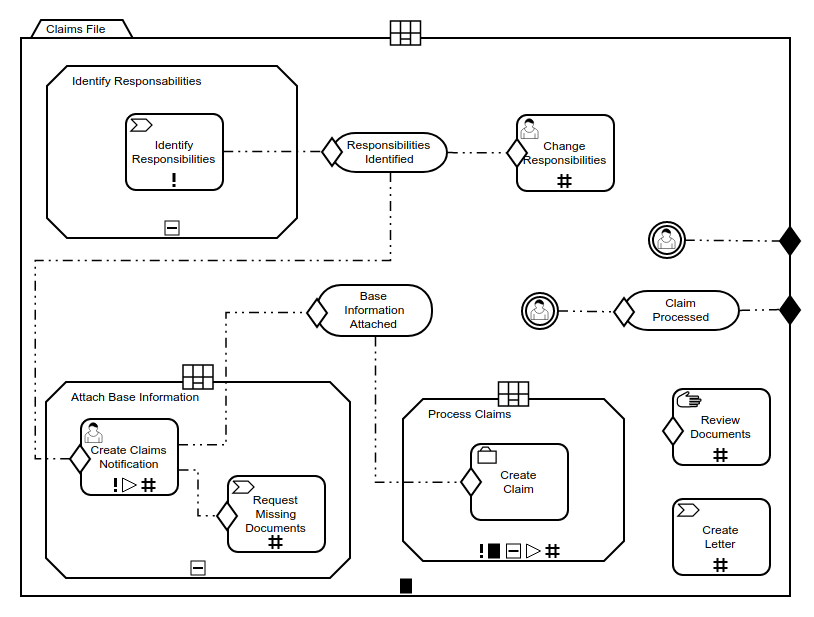

# cmmn-js bundling example

This example showcases how add [cmmn-js](https://github.com/cmmn-io/cmmn-js)
into a node-style application and bundle it for the browser using
[Browserify](http://browserify.org).


## About

This example uses cmmn-js to embed the [claims](https://demo.bpmn.io/cmmn/s/claims-file) diagram into a web application.




## Usage Summary

Install cmmn-js via [npm](http://npmjs.org)

```
npm install --save cmmn-js
```

Use it in your application

```javascript
var CmmnViewer = require('cmmn-js');

var viewer = new CmmnViewer({
  container: '#canvas'
});

viewer.importXML(claimsDiagram, function(err) {

  if (!err) {
    console.log('success!');
    viewer.get('canvas').zoom('fit-viewport');
  } else {
    console.log('something went wrong:', err);
  }
});
```

Bundle the `src/app.js` file for the browser with browserify:

```
browserify src/app.js -t brfs -o public/app.bundled.js
```

__Note:__ You may use another module bundler such as [Webpack](https://webpack.js.org/),
too.


## Building the Example

Initialize the project dependencies via

```
npm install
```

To create the sample distribution in the `public` folder run

```
npm run all
```


## License

MIT